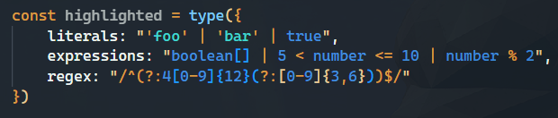
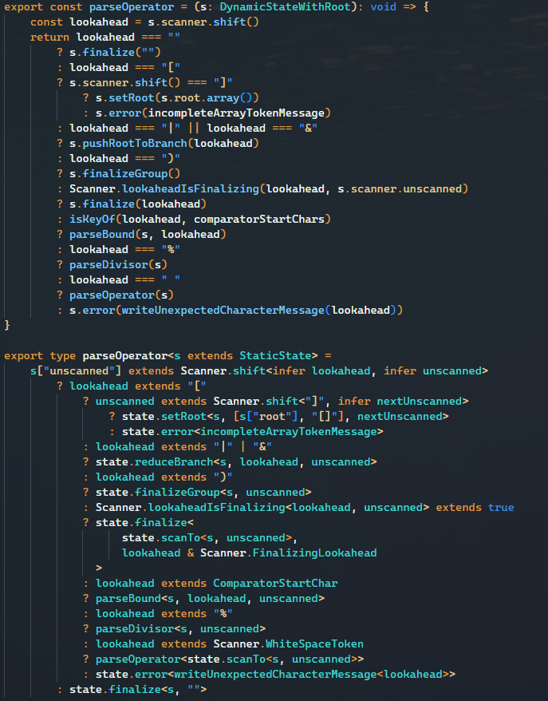

<div align="center">
  
  <h1>ArkDark</h1>
</div>
<div align="center">

[ArkType](https://arktype.io) syntax highlighting and theme⛵

</div>

We're building a 1:1 validator for TypeScript! Check out our core project [on GitHub](https://github.com/arktypeio/arktype)!

## Syntax Highlighting

This extension provides syntax highlighting for strings that are part of an ArkType definition:



## ArkDark Theme

It also includes an editor theme based on ArkType and optimized for type syntax:



## Extending This Theme

- **pnpm build** to generate the arkdark.json theme
- **F5** or **Run > Debugger**, will launch the extension in another window, allowing you to see the changes on any repo you open up

Looking to edit the theme? **(Changes are immediately reflected)**

- **themes** > **arkdark.json**

Looking to change the textmate scopes? **(Must restart the debugger to view changes)**

- arktype.tmLanguage.json

Current textmate scopes can be viewed:

- Open: Command Palette **(Ctrl + Shift + P)**
- Search: **Developer: Inspect Editor Tokens and Scopes**

## Notes

Base color-theme.json copied from VSCode's "Default Dark Modern" (https://github.com/microsoft/vscode/blob/main/extensions/theme-defaults/themes/dark_modern.json).

These are the original colors of defaults that have been overriden:

```json
{
	"editor.foreground": "#CCCCCC",
	"errorForeground": "#F85149"
}
```
